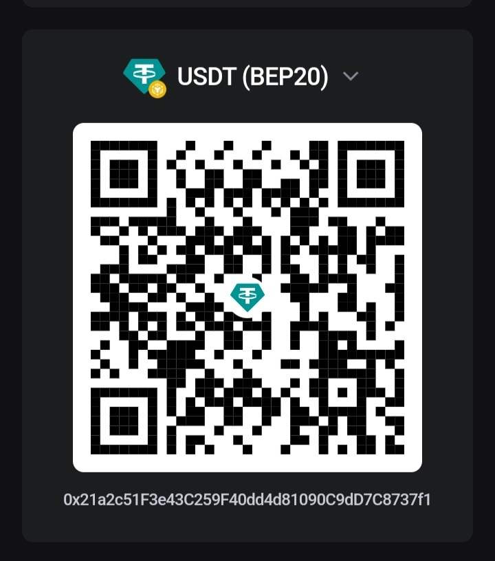

# 🚀 OpenXaiAlgo

> **A high-performance, resilient algorithmic trading engine kernel.**
> Designed for unattended quantitative trading on Linux VPS.

[](https://www.gnu.org/licenses/agpl-3.0)


[English](#english) | [中文](#chinese)

---

<a id="english"></a>
## 🇬🇧 English

### 📖 Introduction

**OpenXaiAlgo** is the core trading engine behind [XaiAlgo.xyz](https://xaialgo.xyz). It is designed to be an extremely stable and fault-tolerant trading host framework.

**This is specifically developed for cryptocurrency, currently supporting the Binance exchange.**

Traditional trading bots often couple strategy logic with underlying execution logic, making code difficult to maintain and risks uncontrollable. OpenXaiAlgo adopts an architecture that **separates the core from the strategy**:
- **Engine (This Repository)**: Responsible for exchange connections, state management, risk control circuit breaking, reconnection, data backfilling, and other "dirty work".
- **Strategies (Plugins)**: Dynamically loaded via `.dll`, allowing you to write private strategies and keep them closed source.

### ✨ Features

#### 🏗️ High Availability
- **Multi-Level Fault Tolerance**: Built-in Polly circuit breaking mechanism; automatic degradation upon continuous API failures.
- **Auto-Restart**: Process guardianship and Exponential Backoff restart strategy.
- **Ghost Order Detection**: Automatically checks order status after network timeouts to prevent lost orders.
- **Atomic Persistence**: State files use a Write -> Temp -> Backup -> Final mechanism to prevent file corruption during power failures.

#### 🛡️ Strict Risk Management
- **Equity Curve Monitoring**: Automatic alert/pause if drawdown exceeds 5% within 1 hour or upon continuous losses.
- **Multi-Dimensional Circuit Breaking**: Supports daily maximum loss, total asset maximum drawdown, and consecutive loss limits.
- **Stop Loss Protection**: Built-in fixed stop loss and Trailing Stop logic.

#### 📊 Data Integrity
- **WebSocket Enhancement**: Real-time K-line push with heartbeat detection and backlog alerts.
- **Disconnection Backfilling**: Automatically backfills missing K-line data via REST API after WebSocket reconnection.

#### 📡 Operations Management
- **HTTP Management API**: Standard REST interface for monitoring status, resetting risk controls, and starting/stopping assets.
- **Prometheus Integration**: Natively exports `/metrics` for direct integration with Grafana monitoring dashboards.
- **Hot Reload Configuration**: Supports runtime parameter modification (Capital, StopLoss, etc.) without restarting.

- **Hot Reload Configuration**: Supports runtime parameter modification (Capital, StopLoss, etc.) without restarting.

### 🗺️ Roadmap / Todo

#### 🏗️ Core & Stability
- [ ] **Unit Testing**: Complete unit test coverage for core components
- [ ] **Data Persistence**: Support SQLite/PostgreSQL for robust trade history storage
- [ ] **CI/CD Integration**: Automatic build and test workflows using GitHub Actions

#### 📈 Strategy & Analysis
- [ ] **Backtesting Engine**: Local historical data backtesting with performance reporting
- [ ] **Machine Learning**: Integrate ONNX Runtime for AI model inference
- [ ] **Strategy Library**: Built-in standard indicators (RSI, MACD, Bollinger Bands)

#### 🛠️ Operations & Usability
- [ ] **Docker Support**: Official Dockerfile and docker-compose.yml for one-click deployment
- [ ] **Web Dashboard**: Modern Blazor/React-based visual management panel
- [ ] **Interactive Bot**: Telegram/Discord bot for real-time control (e.g., `/status`, `/stop`)
- [ ] **Exchange Adapters**: Adapt to more exchanges like OKX, Bybit, etc.


### � Dependencies (.NET Packages)

The project relies on the following key NuGet packages:
- **Binance.Net** (v12.0.0): Official Binance API client.
- **Polly** (v8.5.0): Resilience and transient-fault-handling library.
- **Serilog** (v4.0.0): Structured logging.
- **Microsoft.Extensions.Hosting** (v9.0.0): Host building and lifecycle management.

### 🔌 Strategy Development Guide

OpenXaiAlgo only contains the core engine; you need to write strategy plugins to drive it.

#### 1. Create Strategy Project
Create a .NET 8 Class Library:
```bash
dotnet new classlib -n MyStrategy
```

#### 2. Reference Interfaces
Reference `Reference.dll` or this project's code to implement the `IStrategy` interface:

```csharp
using TradingSystem.Console.Trading.Strategy;

public class SuperStrategy : IStrategy
{
    public string Name => "SuperStrategy";
    
    public void Initialize(Dictionary<string, object> parameters)
    {
        // Read configuration parameters
    }

    public TradingSignal ProcessCandles(IReadOnlyList<Candle> candles)
    {
        // Your core logic
        return TradingSignal.StrongBull; // Emit buy signal
    }
    
    // ... Implement ShouldEnter / ShouldExit
}
```

#### 3. Load Configuration
Compile your dll, place it in the `plugins` directory, and modify `appsettings.json`:

```json
{
  "Assets": [
    {
      "Symbol": "BTCUSDT",
      "AlphaModel": "SuperStrategy",
      "StrategyDll": "MyStrategy.dll",
      "StrategyParams": { "RsiPeriod": 14 }
    }
  ]
}
```

### 🛠️ Quick Start

#### Requirements
- .NET 8.0 SDK
- Linux (Ubuntu 20.04+ / Debian 11+) or Docker

#### Run
```bash
# 1. Clone the repository
git clone https://github.com/Rockywei1/OpenXaiAlgo.git

# 2. Build
dotnet build -c Release

# 3. Run (Configure appsettings.json first)
cd TradingSystem.Console
dotnet run
```


### 🤝 Support / Donate

If this project helped you, consider buying me a coffee!

**USDT (BEP20 / TRC20)**: `0x21a2c51F3e43C259F40dd4d81090C9dD7C8737f1`



### 🌟 Star History

[](https://star-history.com/#Rockywei1/OpenXaiAlgo&Date)

---


<a id="chinese"></a>
## 🇨🇳 中文

### � 简介

**OpenXaiAlgo** 是 [XaiAlgo.xyz](https://xaialgo.xyz) 背后的核心交易引擎。它旨在成为一个极其稳定和容错的交易宿主框架。

**本项目专为加密货币开发，目前支持币安（Binance）交易所。**

传统的交易机器人通常将策略逻辑与底层执行逻辑耦合，导致代码难以维护且风险难以控制。OpenXaiAlgo 采用**核心与策略分离**的架构：
- **引擎 (本仓库)**: 负责交易所连接、状态管理、风控熔断、重连、数据回补等“脏活累活”。
- **策略 (插件)**: 通过 `.dll` 动态加载，允许您编写私有策略并保持闭源。

### ✨ 特性

#### 🏗️ 高可用性
- **多级容错**: 内置 Polly 熔断机制；连续 API 失败时自动降级。
- **自动重启**: 进程守护和指数退避重启策略。
- **幽灵订单检测**: 网络超时后自动检查订单状态，防止丢单。
- **原子持久化**: 状态文件使用 写入 -> 临时 -> 备份 -> 最终 机制，防止断电导致文件损坏。

#### 🛡️ 严格风控
- **资金曲线监控**: 如果 1 小时内回撤超过 5% 或连续亏损，自动报警/暂停。
- **多维熔断**: 支持每日最大亏损、总资产最大回撤和连续亏损限制。
- **止损保护**: 内置固定止损和移动止损（Trailing Stop）逻辑。

#### 📊 数据完整性
- **WebSocket 增强**: 实时 K 线推送，带心跳检测和积压报警。
- **断线回补**: WebSocket 重连后，自动通过 REST API 回补缺失的 K 线数据。

#### 📡 运维管理
- **HTTP 管理 API**: 标准 REST 接口，用于监控状态、重置风控和启动/停止资产。
- **Prometheus 集成**: 原生导出 `/metrics`，可直接集成 Grafana 监控仪表板。
- **热重载配置**: 支持运行时修改参数（资金、止损等），无需重启。

- **热重载配置**: 支持运行时修改参数（资金、止损等），无需重启。

### 🗺️ 路线图 / 待办事项

#### 🏗️ 核心与稳定性
- [ ] **单元测试**: 完善核心组件的单元测试覆盖率
- [ ] **数据持久化**: 支持 SQLite/PostgreSQL 以实现更健壮的交易记录存储
- [ ] **CI/CD 集成**: 使用 GitHub Actions 实现自动构建和测试工作流

#### 📈 策略与分析
- [ ] **回测引擎**: 支持本地历史数据回测及性能报告
- [ ] **机器学习**: 集成 ONNX Runtime 以支持 AI 模型推理
- [ ] **策略库**: 内置标准指标库（RSI, MACD, Bollinger Bands）

#### 🛠️ 运维与易用性
- [ ] **Docker 支持**: 提供官方 Dockerfile 和 docker-compose.yml 实现一键部署
- [ ] **Web 仪表板**: 基于 Blazor/React 的可视化管理面板
- [ ] **交互式机器人**: Telegram/Discord 机器人实现实时控制（如 `/status`, `/stop`）
- [ ] **交易所适配**: 适配更多交易所，如 OKX, Bybit 等


### 📦 依赖项 (.NET 包)

本项目依赖以下关键 NuGet 包：
- **Binance.Net** (v12.0.0): 官方币安 API 客户端。
- **Polly** (v8.5.0): 弹性与瞬态故障处理库。
- **Serilog** (v4.0.0): 结构化日志。
- **Microsoft.Extensions.Hosting** (v9.0.0): 主机构建与生命周期管理。

### 🔌 策略开发指南

OpenXaiAlgo 仅包含核心引擎；您需要编写策略插件来驱动它。

#### 1. 创建策略项目
创建一个 .NET 8 类库：
```bash
dotnet new classlib -n MyStrategy
```

#### 2. 引用接口
引用 `Reference.dll` 或本项目代码以实现 `IStrategy` 接口：

```csharp
using TradingSystem.Console.Trading.Strategy;

public class SuperStrategy : IStrategy
{
    public string Name => "SuperStrategy";
    
    public void Initialize(Dictionary<string, object> parameters)
    {
        // 读取配置参数
    }

    public TradingSignal ProcessCandles(IReadOnlyList<Candle> candles)
    {
        // 您的核心逻辑
        return TradingSignal.StrongBull; // 发出买入信号
    }
    
    // ... 实现 ShouldEnter / ShouldExit
}
```

#### 3. 加载配置
编译您的 dll，将其放入 `plugins` 目录，并修改 `appsettings.json`：

```json
{
  "Assets": [
    {
      "Symbol": "BTCUSDT",
      "AlphaModel": "SuperStrategy",
      "StrategyDll": "MyStrategy.dll",
      "StrategyParams": { "RsiPeriod": 14 }
    }
  ]
}
```

### 🛠️ 快速开始

#### 环境要求
- .NET 8.0 SDK
- Linux (Ubuntu 20.04+ / Debian 11+) 或 Docker

#### 运行
```bash
# 1. 克隆仓库
git clone https://github.com/Rockywei1/OpenXaiAlgo.git

# 2. 构建
dotnet build -c Release

# 3. 运行 (需先配置 appsettings.json)
cd TradingSystem.Console
dotnet run
```

---

## 📄 许可证
本项目采用 **GNU Affero General Public License v3.0 (AGPL-3.0)** 许可。
这意味着如果您通过网络（例如 SaaS）提供基于本项目的服务，您必须向用户公开修改后的源代码。


### 🤝 支持 / 捐赠

如果本项目帮助了您，欢迎请我喝杯咖啡！

**USDT (BEP20 / TRC20)**: `0x21a2c51F3e43C259F40dd4d81090C9dD7C8737f1`


### 🌟 Star 历史

[](https://star-history.com/#Rockywei1/OpenXaiAlgo&Date)

Copyright © 2026 XaiAlgo.xyz

